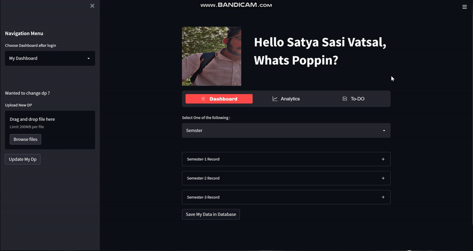
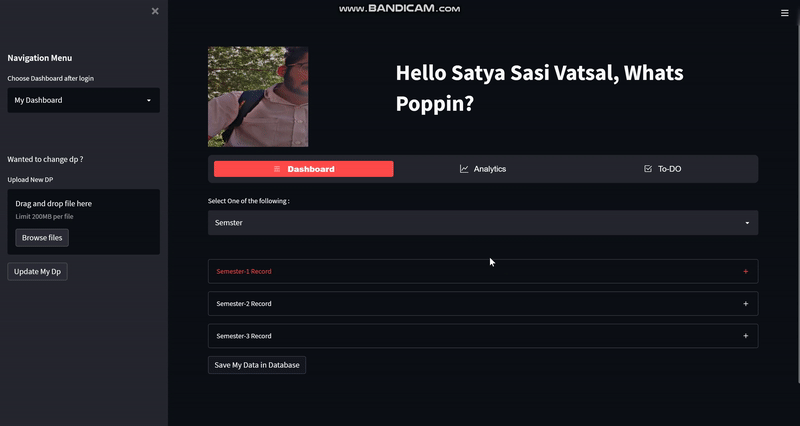
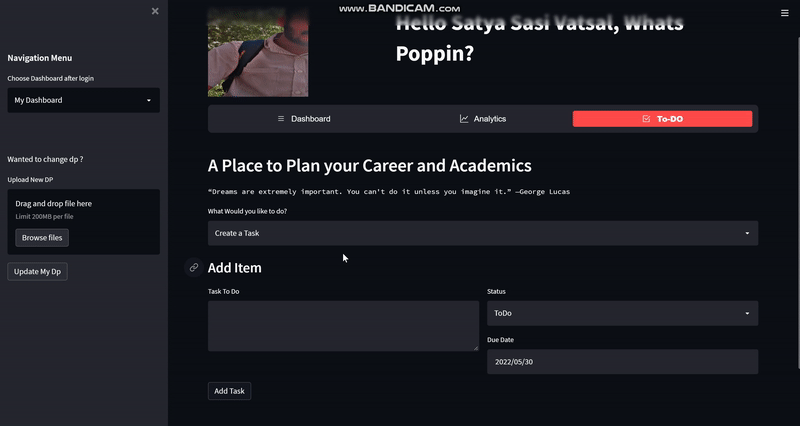
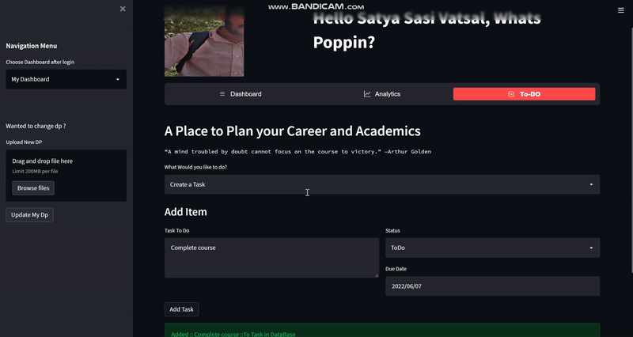
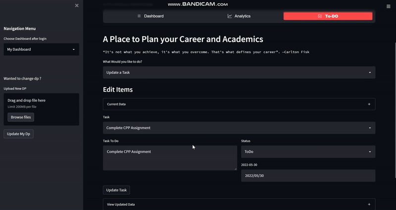
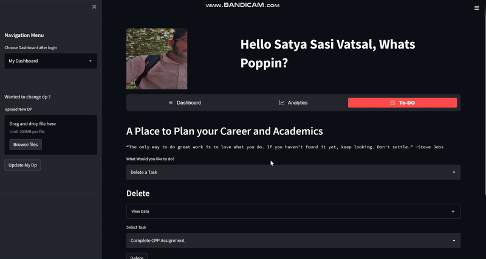

<h1 align="center">|><|===> My Academic Record✍️💻 <===|><|</h1>

 ### My Academic Record is a Multi-Page Full Stack Web application made entirely from Python🐍. My Academic Record is powerful web based app which serves an important purpose that is storing and tracking your academic performance and history like a digital diary or a log of you academic status. Not just recording it also provides data analytics of your performnace in an Aesthetic and visually pleasing graphs. The entire application is Responsive hence can be accessed in any device ranging from a smartphone to desktop. 
  
#### The moto of making this app is i personally feel unanswerable where i'm lacking or whether is there any improvement or consistency in my perfromance compared to the last semester, why care you ask coz these little things matter in the end and we are just too lazy to enter those marks in a physical diary or keep record of them and carry, the solution is a web app which can be accessed anywhere on any device any time and there is no question of loosing the log cause eveything is digital as it should be in 21st century 
  
 # How to Use the App:
## If you haven't sign up yet you have to sign up to use the app

## After creating an account, sign in into your account
  

## After Sign-in Your Dashboard looks like this:

  ### Navigate through Different option from the Horizontal NavBar
  

  ## Detailed Analytics can be viewed in the analtics sention
  

  ## There is Also a To-Do app built in which can be used as planner as well as scheduler

  <h3 align="center">You can Create a task</h3>
  

  <h3 align="center">You can Read a task</h3>
  

  <h3 align="center">You can Update a task</h3>
  

  <h3 align="center">You can Delete a task</h3>
  

  
