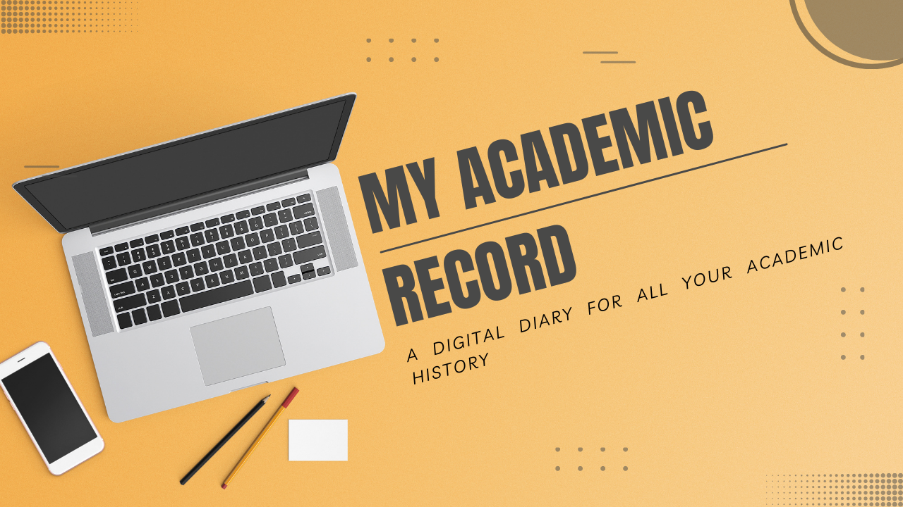
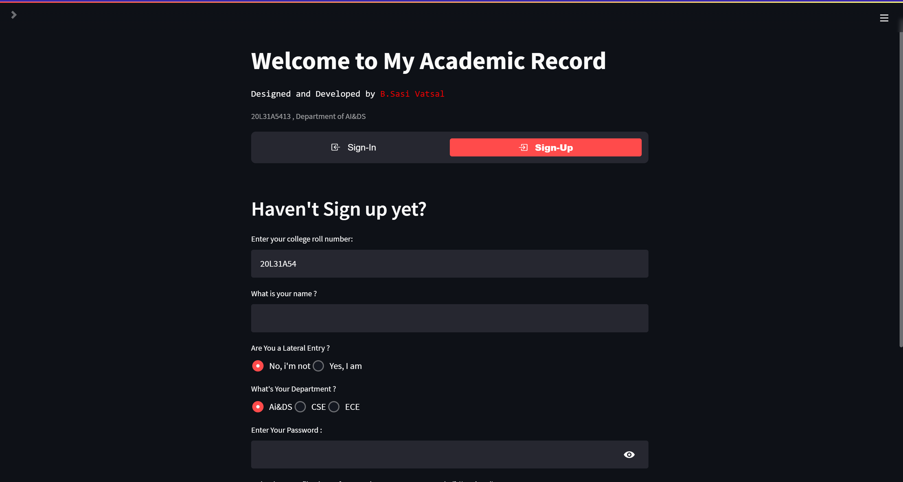
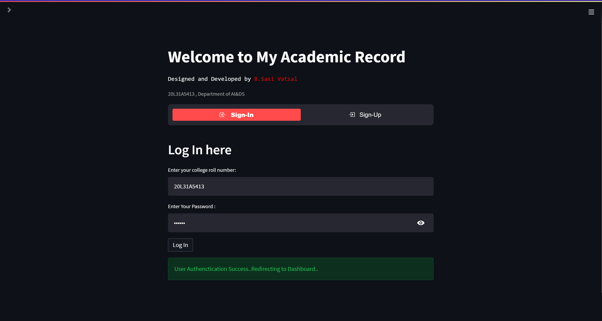
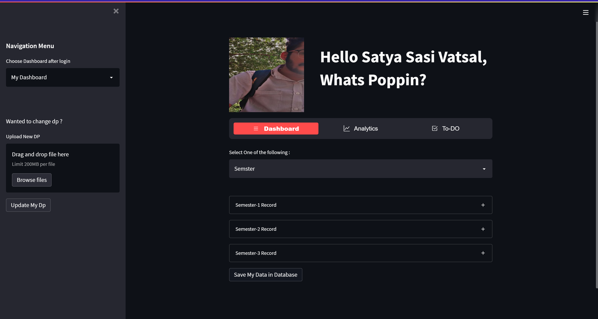

<h1 align="center">|><|===> My Academic Record✍️💻 <===|><|</h1>

 ### My Academic Record is a Multi-Page Full Stack Web application made entirely from Python🐍. My Academic Record is powerful web based app which serves an important purpose that is storing and tracking your academic performance and history like a digital diary or a log of you academic status. Not just recording it also provides data analytics of your performnace in an Aesthetic and visually pleasing graphs. The entire application is Responsive hence can be accessed in any device ranging from a smartphone to desktop. 
  
#### The moto of making this app is i personally feel unanswerable where i'm lacking or whether is there any improvement or consistency in my perfromance compared to the last semester, why care you ask coz these little things matter in the end and we are just too lazy to enter those marks in a physical diary or keep record of them and carry, the solution is a web app which can be accessed anywhere on any device any time and there is no question of loosing the log cause eveything is digital as it should be in 21st century 
  
 # How to Use the App:
## If you haven't sign up yet you have to sign up to use the app

## After creating an account, sign in into your account
  

## After Sign-in Your Dashboard looks like this:

  ### Navigate through Different option from the Horizontal NavBar
  

  
  https://user-images.githubusercontent.com/71326149/171015307-fa9cbfe3-d534-4a15-9836-9c79ad252ed3.mp4

## If you are your new user enter your data or if your an existing user you edit your previously entered data or enter new data
 
  https://user-images.githubusercontent.com/71326149/171015471-b223b815-e09e-46cb-bff6-6f17ceb04010.mp4
 
  ## Detailed Analytics can be viewed in the analtics sention
  
 https://user-images.githubusercontent.com/71326149/171014706-9d5bb5af-b496-40f0-b71c-0053fc40dc6d.mp4

  ## There is Also a To-Do app built in which can be used as planner as well as scheduler

  <h2 align="center">You can Create a task</h2>
  
 https://user-images.githubusercontent.com/71326149/171014823-b7a2607c-381b-4e18-b0d9-ea2bcb9b3670.mp4

  <h2 align="center">You can Read a task</h2>
  
 https://user-images.githubusercontent.com/71326149/171014888-ab788bf6-6a54-44ba-8fe9-3eb96ee89660.mp4

  <h2 align="center">You can Update a task</h2>
  
 https://user-images.githubusercontent.com/71326149/171014945-daf8eb17-4558-4e22-adec-e1d7d7919fe9.mp4

  <h2 align="center">You can Delete a task</h2>
  
 https://user-images.githubusercontent.com/71326149/171015001-ac771daa-d0de-463b-bd20-3f5e366369e3.mp4

# Challenges and the Hustle
 - ### More then making a WebApp which can be used day to day i made My Acad Rec as a Personal Challenge given to me by me
 - ### The Challenge is to create 
   - #### A WebApp entirely from Python 
   - #### The WebApp should be Dynamic and Full-Stack with all CRUD Operations
   - #### Should not use a database or integrate an external Database
   - #### Make an Authenticated Sign-Up & Sign-In System in streamlit itself
   - #### Validate/Authenticate Users when they Sign-in 
   - #### Should contain all the operations as a Full-Stack app 
   - #### The entire app should be made under 1500 lines ( final version exceeded >1700 lines)
   - #### A App which had rich UI/UX and zero functionality errors
 - ### The Motto behind to not to use a database is to challenge the logical side of me, with a database like sql lite3 things are so easy the entire app can be made in a week with zero scope of errors or crashes, the struggle come with no database to store or request data. With no database the work of getting,saving,storing,accessing and requesting data becomes so sensitive and difficult. Why the Struggle you ask..idk...why do people still use vanilla CSS when there are frameworks which make life easier like tailwind css, bootstrap ?! it's just how it is.

